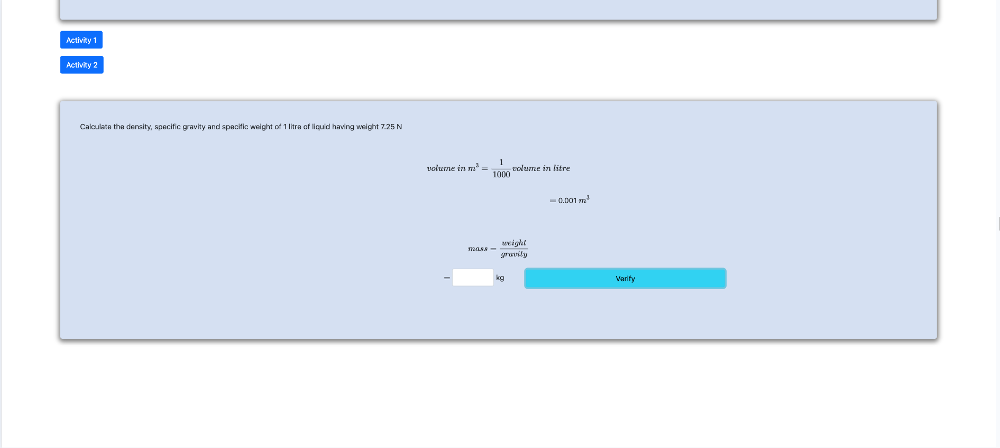

<h2>Follow the below steps to perform the experiment on the simulator</h2>
 

Step 1 : Click next to start.

Step 2 : Calculate the volume in m3 and click verify.

Step 3 : Calculate the density then click verify.

Step 4 : New problem statement appears, Calculate the volume in litres

Step 5 : Calculate the mass in kg

Step 6 : Calculate the density

Step 7 : Calculate the specific garvity

Step 8 : Calculate the specific weight

